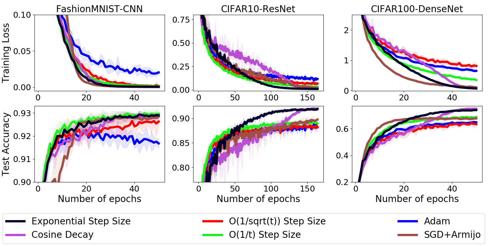
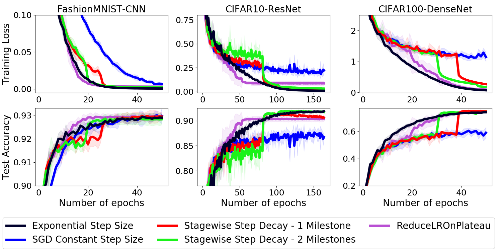

### Code & Usage
`src` folder contains codes for training a deep neural network to do image classification on FashionMNIST and CIFAR10/100. You can train models with the `main.py` script, with hyper-parameters being specified as flags (see --help for a detailed list and explanation).

After obtaining the results, to see the comparison, use `draw_comps.py` by specifying the logs folder, and `fig-type` (either "stagewise" or "others"), for example:
```
python draw_comps.py --logs-folder ./logs/CIFAR10 --fig-type stagewise
```

### Results:
Below, we consider five SGD variants each employs a different decaying step size schedule instead of a constant one:
* Exponential step size: ;
* O(1/t) decay: &eta;<sub>t</sub> = &eta;<sub>0</sub>/(1+&alpha;t);
* O(1/sqrt(t)): &eta;<sub>t</sub> = &eta;<sub>0</sub>/(1+&alpha;&radic;t);
* Cosine decay: &eta;<sub>t</sub> = &eta;<sub>0</sub>*(1+cos(&pi;*t/T))/2;
* Stagewise step decay:  if  which are called milestones.

Each method is fine-tuned using grid search. After finding the best hyperparameters, we employ them to do the test. The testing stage is repeated with different random seeds for 5 times to eliminate the influence of stochasticity. The shadow over a curve and the "±" represent the 95% confidence interval of the mean loss / accuracy value over these 5 runs.





<sup>
<table width="100%">

  |Optimizer | Training loss | Test accuracy | Training loss | Test accuracy | Training loss | Test accuracy |
  | ----------- | ----------- | ----------- | ----------- | ----------- | ----------- | :--------------:  |
  |SGD Constant Step Size | 0.0068 ± 0.0023 | 0.9297 ± 0.0033 | 0.2226 ± 0.0169 | 0.8674 ± 0.0048 | 1.1467 ± 0.1437 | 0.5896 ± 0.0404 |
  |O(1/t) Step Size | 0.0013 ± 0.0004 | **0.9297 ± 0.0021** | 0.0331 ± 0.0028 | 0.8894 ± 0.0040 | 0.3489 ± 0.0263 | 0.6874 ± 0.0076 |
  |O(1/sqrt(t)) Step Size | 0.0016 ± 0.0005 | 0.9262 ± 0.0014 | 0.0672 ± 0.0086 | 0.8814 ± 0.0034 | 0.8147 ± 0.0717 | 0.6336 ± 0.0169 |
  |[Cosine Decay](https://arxiv.org/abs/1812.01187) | 0.0004 ± 0.0000 | 0.9285 ± 0.0019 | 0.0106 ± 0.0008 | **0.9199 ± 0.0029** | 0.0949 ± 0.0053 | **0.7497 ± 0.0044** |
  |[Adam](https://arxiv.org/abs/1412.6980) | 0.0203 ± 0.0021 | 0.9168 ± 0.0023 | 0.1161 ± 0.0111 | 0.8823 ± 0.0041 | 0.6513 ± 0.0154 | 0.6478 ± 0.0054 |
  |[SGD+Armijo](https://arxiv.org/abs/1905.09997) | **0.0003 ± 0.0000** | 0.9284 ± 0.0016 | 0.0185 ± 0.0043 | 0.8973 ± 0.0071 | 0.1063 ± 0.0153 | 0.6768 ± 0.0044 |
  |[ReduceLROnPlateau](https://pytorch.org/docs/stable/optim.html#torch.optim.lr_scheduler.ReduceLROnPlateau) | 0.0031 ± 0.0009 | 0.9294 ± 0.0015 | 0.0867 ± 0.0230 | 0.9033 ± 0.0049 | 0.0927 ± 0.0085 | 0.7435 ± 0.0076 |
  |Stagewise - 1 Milestone | 0.0007 ± 0.0002 | 0.9294 ± 0.0018 | 0.0269 ± 0.0017 | 0.9062 ± 0.0020 | 0.2673 ± 0.0084 | 0.7459 ± 0.0030 |
  |Stagewise - 2 Milestones | 0.0023 ± 0.0005 | 0.9283 ± 0.0024 | 0.0322 ± 0.0008 | 0.9174 ± 0.0020 | 0.1783 ± 0.0030 | 0.7487 ± 0.0025 |
  |Exponential Step Size | 0.0006 ± 0.0001 | 0.9290 ± 0.0009 | **0.0098 ± 0.0010** | 0.9188 ± 0.0033 | **0.0714 ± 0.0041** | 0.7398 ±  0.0037 |

</table>
</sup>


### Reproducing Results


#### FashionMNIST
```
python ./src/main.py --optim-method SGD --eta0 0.007 --nesterov --momentum 0.9 --weight-decay 0.0001 --train-epochs 50 --batchsize 128 --eval-interval 1 --use-cuda --log-folder ./logs/FashionMNIST --dataset FashionMNIST --dataroot ./data

python ./src/main.py --optim-method SGD_Stage_Decay --eta0 0.04 --alpha 0.1 --milestones 12000 --nesterov --momentum 0.9 --weight-decay 0.0001 --train-epochs 50 --batchsize 128 --eval-interval 1 --use-cuda --log-folder ./logs/FashionMNIST --dataset FashionMNIST --dataroot ./data

python ./src/main.py --optim-method SGD_Stage_Decay --eta0 0.04 --alpha 0.1 --milestones 9000 15000 --nesterov --momentum 0.9 --weight-decay 0.0001 --train-epochs 50 --batchsize 128 --eval-interval 1 --use-cuda --log-folder ./logs/FashionMNIST --dataset FashionMNIST --dataroot ./data

python ./src/main.py --optim-method SGD_ReduceLROnPlateau --eta0 0.04 --alpha 0.5 --patience 3 --threshold 0.001 --nesterov --momentum 0.9 --weight-decay 0.001 --train-epochs 50 --batchsize 128 --eval-interval 1 --use-cuda --log-folder ./logs/FashionMNIST --dataset FashionMNIST --dataroot ./data

python ./src/main.py --optim-method SGD_1sqrt_Decay --eta0 0.05 --alpha 0.00653 --nesterov --momentum 0.9 --weight-decay 0.0001 --train-epochs 50 --batchsize 128 --eval-interval 1 --use-cuda --log-folder ./logs/FashionMNIST --dataset FashionMNIST --dataroot ./data

python ./src/main.py --optim-method SGD_1t_Decay --eta0 0.05 --alpha 0.000384 --nesterov --momentum 0.9 --weight-decay 0.0001 --train-epochs 50 --batchsize 128 --eval-interval 1 --use-cuda --log-folder ./logs/FashionMNIST --dataset FashionMNIST --dataroot ./data

python ./src/main.py --optim-method SGD_Exp_Decay --eta0 0.05 --alpha 0.999902 --nesterov --momentum 0.9 --weight-decay 0.0001 --train-epochs 50 --batchsize 128 --eval-interval 1 --use-cuda --log-folder ./logs/FashionMNIST --dataset FashionMNIST --dataroot ./data

python ./src/main.py --optim-method Adam --eta0 0.0009 --weight-decay 0.0001 --train-epochs 50 --batchsize 128 --eval-interval 1 --use-cuda --log-folder ./logs/FashionMNIST --dataset FashionMNIST --dataroot ./data

python ./src/main.py --optim-method SGD_Cosine_Decay --eta0 0.05 --nesterov --momentum 0.9 --weight-decay 0.0001 --train-epochs 50 --batchsize 128 --eval-interval 1 --use-cuda --log-folder ./logs/FashionMNIST --dataset FashionMNIST --dataroot ./data

python ./src/main.py --optim-method SLS-Armijo1 --eta0 0.5 --c 0.1 --train-epochs 50 --batchsize 128 --eval-interval 1 --use-cuda --log-folder ./logs/FashionMNIST --dataset FashionMNIST --dataroot ./data
```


#### CIFAR10
```
python ./src/main.py --optim-method SGD --eta0 0.07 --nesterov --momentum 0.9 --weight-decay 0.0001 --train-epochs 164 --batchsize 128 --eval-interval 1 --use-cuda --log-folder ./logs/CIFAR10 --dataset CIFAR10 --dataroot ./data

python ./src/main.py --optim-method SGD_Stage_Decay --eta0 0.1 --alpha 0.1 --milestones 32000 --nesterov --momentum 0.9 --weight-decay 0.0001 --train-epochs 164 --batchsize 128 --eval-interval 1 --use-cuda --log-folder ./logs/CIFAR10 --dataset CIFAR10 --dataroot ./data

python ./src/main.py --optim-method SGD_Stage_Decay --eta0 0.2 --alpha 0.1 --milestones 32000 40000 --nesterov --momentum 0.9 --weight-decay 0.0001 --train-epochs 164 --batchsize 128 --eval-interval 1 --use-cuda --log-folder ./logs/CIFAR10 --dataset CIFAR10 --dataroot ./data

python ./src/main.py --optim-method SGD_ReduceLROnPlateau --eta0 0.07 --alpha 0.1 --patience 10 --threshold 0.001 --nesterov --momentum 0.9 --weight-decay 0.0001 --train-epochs 164 --batchsize 128 --eval-interval 1 --use-cuda --log-folder ./logs/CIFAR10 --dataset CIFAR10 --dataroot ./data

python ./src/main.py --optim-method SGD_1sqrt_Decay --eta0 0.2 --alpha 0.079079 --nesterov --momentum 0.9 --weight-decay 0.0001 --train-epochs 164 --batchsize 128 --eval-interval 1 --use-cuda --log-folder ./logs/CIFAR10 --dataset CIFAR10 --dataroot ./data

python ./src/main.py --optim-method SGD_1t_Decay --eta0 0.1 --alpha 0.000230 --nesterov --momentum 0.9 --weight-decay 0.0001 --train-epochs 164 --batchsize 128 --eval-interval 1 --use-cuda --log-folder ./logs/CIFAR10 --dataset CIFAR10 --dataroot ./data

python ./src/main.py --optim-method SGD_Exp_Decay --eta0 0.1 --alpha 0.99991 --nesterov --momentum 0.9 --weight-decay 0.0005 --train-epochs 164 --batchsize 128 --eval-interval 1 --use-cuda --log-folder ./logs/CIFAR10 --dataset CIFAR10 --dataroot ./data

python ./src/main.py --optim-method Adam --eta0 0.0009 --weight-decay 0.0001 --train-epochs 164 --batchsize 128 --eval-interval 1 --use-cuda --log-folder ./logs/CIFAR10 --dataset CIFAR10 --dataroot ./data

python ./src/main.py --optim-method SGD_Cosine_Decay --eta0 0.25 --nesterov --momentum 0.9 --weight-decay 0.0001 --train-epochs 164 --batchsize 128 --eval-interval 1 --use-cuda --log-folder ./logs/CIFAR10 --dataset CIFAR10 --dataroot ./data

python ./src/main.py --optim-method SLS-Armijo0 --eta0 2.5 --c 0.1 --train-epochs 164 --batchsize 128 --eval-interval 1 --use-cuda --log-folder ./logs/CIFAR10 --dataset CIFAR10 --dataroot ./data
```


#### CIFAR100
```
python ./src/main.py --optim-method SGD --eta0 0.07 --nesterov --momentum 0.9 --weight-decay 0.0005 --train-epochs 50 --batchsize 128 --eval-interval 1 --use-cuda --log-folder ./logs/CIFAR100 --dataset CIFAR100 --dataroot ./data

python ./src/main.py --optim-method SGD_Stage_Decay --eta0 0.07 --alpha 0.1 --milestones 15000 --nesterov --momentum 0.9 --weight-decay 0.0005 --train-epochs 50 --batchsize 128 --eval-interval 1 --use-cuda --log-folder ./logs/CIFAR100 --dataset CIFAR100 --dataroot ./data

python ./src/main.py --optim-method SGD_Stage_Decay --eta0 0.07 --alpha 0.1 --milestones 12000 18000 --nesterov --momentum 0.9 --weight-decay 0.0005 --train-epochs 50 --batchsize 128 --eval-interval 1 --use-cuda --log-folder ./logs/CIFAR100 --dataset CIFAR100 --dataroot ./data

python ./src/main.py --optim-method SGD_ReduceLROnPlateau --eta0 0.1 --alpha 0.5 --patience 3 --threshold 0.001 --nesterov --momentum 0.9 --weight-decay 0.0005 --train-epochs 50 --batchsize 128 --eval-interval 1 --use-cuda --log-folder ./logs/CIFAR100 --dataset CIFAR100 --dataroot ./data

python ./src/main.py --optim-method SGD_1sqrt_Decay --eta0 0.1 --alpha 0.015 --nesterov --momentum 0.9 --weight-decay 0.0005 --train-epochs 50 --batchsize 128 --eval-interval 1 --use-cuda --log-folder ./logs/CIFAR100 --dataset CIFAR100 --dataroot ./data

python ./src/main.py --optim-method SGD_1t_Decay --eta0 0.8 --alpha 0.004 --nesterov --momentum 0.9 --weight-decay 0.0005 --train-epochs 50 --batchsize 128 --eval-interval 1 --use-cuda --log-folder ./logs/CIFAR100 --dataset CIFAR100 --dataroot ./data

python ./src/main.py --optim-method SGD_Exp_Decay --eta0 0.2 --alpha 0.999744 --nesterov --momentum 0.9 --weight-decay 0.0005 --train-epochs 50 --batchsize 128 --eval-interval 1 --use-cuda --log-folder ./logs/CIFAR100 --dataset CIFAR100 --dataroot ./data

python ./src/main.py --optim-method Adam --eta0 0.0009 --weight-decay 0.0005 --train-epochs 50 --batchsize 128 --eval-interval 1 --use-cuda --log-folder ./logs/CIFAR100 --dataset CIFAR100 --dataroot ./data

python ./src/main.py --optim-method SGD_Cosine_Decay --eta0 0.09 --nesterov --momentum 0.9 --weight-decay 0.0005 --train-epochs 50 --batchsize 128 --eval-interval 1 --use-cuda --log-folder ./logs/CIFAR100 --dataset CIFAR100 --dataroot ./data

python ./src/main.py --optim-method SLS-Armijo2 --eta0 5 --c 0.5 --train-epochs 50 --batchsize 128 --eval-interval 1 --use-cuda --log-folder ./logs/CIFAR100 --dataset CIFAR100 --dataroot ./data
```
