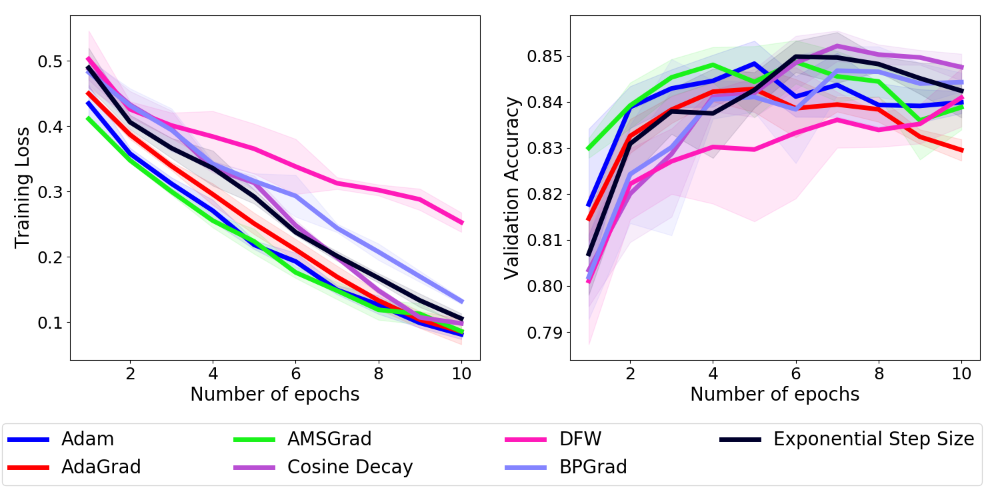

Codes are based on:

https://github.com/oval-group/dfw

https://github.com/facebookresearch/InferSent


### Usage

First you need to get GloVe, SNLI and MultiNLI [2GB, 90MB, 216MB] by running (in dataset/):
```bash
./get_data.bash
```
This will download GloVe and preprocess SNLI/MultiNLI datasets. For MacOS, you may have to use *p7zip* instead of *unzip*. 


`src` folder contains codes for training a bi-directional LSTM to do natural language inference on SNLI. You can train models with the `train_nil.py` script, with hyper-parameters being specified as flags (use `--help` for a detailed list and explanation).

After obtaining the results, to see the comparison, use `draw_comps.py` by specifying the logs folder, for example:
```
python draw_comps.py --logs-folder ./logs
```

### Results:

<p> Each method is fine-tuned using grid search. After finding the best hyperparameters, we employ them to do the test in which we report the test accuracy of the model that yields the best validation accuracy during the whole training process. The testing stage is repeated with different random seeds for 5 times to eliminate the influence of stochasticity. The shadow over a curve and the "±" represent the 95% confidence interval of the mean loss / accuracy value over these 5 runs. </p>



<table>

| Optimizer | Test Accuracy (%) |
| --------- | :--------------:  |
| [Adam](https://arxiv.org/abs/1412.6980) | 0.8479 ± 0.0043 |
| [AdaGrad](http://www.jmlr.org/papers/volume12/duchi11a/duchi11a.pdf) | 0.8446 ± 0.0027 |
| [AMSGrad](https://openreview.net/forum?id=ryQu7f-RZ) | 0.8475 ± 0.0029 |
| [DFW](https://arxiv.org/abs/1811.07591) | 0.8412 ± 0.0045 |
| [BPGrad](http://openaccess.thecvf.com/content_cvpr_2018/papers/Zhang_BPGrad_Towards_Global_CVPR_2018_paper.pdf) | 0.8459 ± 0.0030 |
| [Cosine Decay](https://arxiv.org/abs/1812.01187) | **0.8509 ± 0.0033** |
| Exp. Step Size | 0.8502 ± 0.0028 |

</table>


### Reproducing Results
```
python train_nli.py --opt adagrad --eta 0.01 --momentum 0.9 --loss svm --n_epochs 10 --no-tqdm --data_root ./dataset --log_folder ./logs

python train_nli.py --opt amsgrad --eta 0.0001 --momentum 0.9 --loss svm --n_epochs 10 --no-tqdm --data_root ./dataset --log_folder ./logs

python train_nli.py --opt bpgrad --eta 0.1 --momentum 0.9 --loss svm --n_epochs 10 --no-tqdm --data_root ./dataset --log_folder ./logs

python train_nli.py --opt SGD_Cosine_Decay --eta 0.1 --momentum 0.9 --loss svm --n_epochs 10 --no-tqdm --data_root ./dataset --log_folder ./logs

python train_nli.py --opt adam --eta 0.0001 --momentum 0.9 --loss svm --n_epochs 10 --no-tqdm --data_root ./dataset --log_folder ./logs

python train_nli.py --opt dfw --eta 0.1 --momentum 0.9 --loss svm --n_epochs 10 --no-tqdm --data_root ./dataset --log_folder ./logs

python train_nli.py --opt SGD_Exp_Decay --eta 0.1 --alpha 0.99997317 --loss svm --momentum 0.9 --n_epochs 10 --no-tqdm --data_root ./dataset --log_folder ./logs
```
